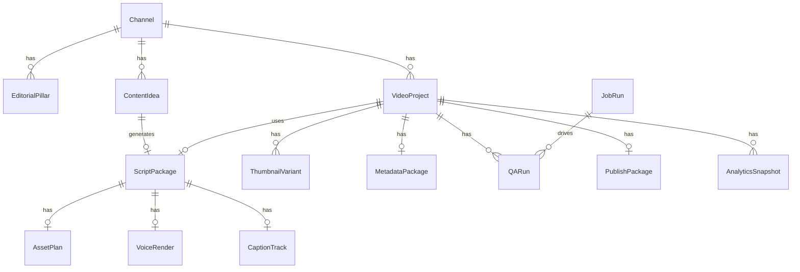

# DarkTube OS — Data Model
Version: 1.0

---

## Entity Overview

The following 14 entities form the DarkTube OS data model (spec section 15.1):

| # | Entity | Table |
|---|--------|-------|
| 1 | Channel | `channels` |
| 2 | EditorialPillar | `editorial_pillars` |
| 3 | ContentIdea | `content_ideas` |
| 4 | ScriptPackage | `script_packages` |
| 5 | AssetPlan | `asset_plans` |
| 6 | VoiceRender | `voice_renders` |
| 7 | CaptionTrack | `caption_tracks` |
| 8 | VideoProject | `video_projects` |
| 9 | ThumbnailVariant | `thumbnail_variants` |
| 10 | MetadataPackage | `metadata_packages` |
| 11 | QARun | `qa_runs` |
| 12 | PublishPackage | `publish_packages` |
| 13 | AnalyticsSnapshot | `analytics_snapshots` |
| 14 | JobRun | `job_runs` |

---

## Entity Definitions

### Channel
**Table:** `channels`

| Field | Type | Notes |
|---|---|---|
| id | TEXT PK | CUID |
| name | TEXT NOT NULL | Display name |
| slug | TEXT NOT NULL UNIQUE | URL-safe identifier |
| description | TEXT | Channel description |
| niche | TEXT | Primary niche/category |
| target_audience | TEXT | Description of target viewer |
| tone_profile_json | TEXT | JSON — see JSON Field Schemas |
| default_voice_id | TEXT | Provider voice ID |
| default_voice_provider | TEXT | e.g. "elevenlabs", "openai" |
| youtube_channel_id | TEXT | YouTube channel identifier |
| created_at | TEXT NOT NULL | ISO 8601 |
| updated_at | TEXT NOT NULL | ISO 8601 |

**Indexes:** `slug`, `youtube_channel_id`

---

### EditorialPillar
**Table:** `editorial_pillars`

| Field | Type | Notes |
|---|---|---|
| id | TEXT PK | CUID |
| channel_id | TEXT NOT NULL FK | References channels.id |
| name | TEXT NOT NULL | Pillar name |
| description | TEXT | What content belongs here |
| keywords | TEXT | Comma-separated seed keywords |
| weight | REAL | Relative scheduling weight (0.0–1.0) |
| active | INTEGER NOT NULL DEFAULT 1 | Boolean: 1=active |
| created_at | TEXT NOT NULL | ISO 8601 |
| updated_at | TEXT NOT NULL | ISO 8601 |

**Indexes:** `channel_id`

---

### ContentIdea
**Table:** `content_ideas`

| Field | Type | Notes |
|---|---|---|
| id | TEXT PK | CUID |
| channel_id | TEXT NOT NULL FK | References channels.id |
| pillar_id | TEXT FK | References editorial_pillars.id |
| title | TEXT NOT NULL | Idea headline |
| hook | TEXT | Opening hook sentence |
| angle | TEXT | Unique content angle |
| status | TEXT NOT NULL DEFAULT 'NEW' | Idea state (see State Machine) |
| total_score | REAL | Aggregate score 0–100 |
| score_breakdown_json | TEXT | JSON — see JSON Field Schemas |
| originality_score | REAL | 0–100, from originality check |
| originality_checked_at | TEXT | ISO 8601 |
| source | TEXT | Where idea was discovered |
| seed_phrase | TEXT | Triggering search phrase |
| competitor_urls | TEXT | JSON array of competitor URLs |
| created_at | TEXT NOT NULL | ISO 8601 |
| updated_at | TEXT NOT NULL | ISO 8601 |

**Indexes:** `channel_id`, `pillar_id`, `status`, `total_score`

---

### ScriptPackage
**Table:** `script_packages`

| Field | Type | Notes |
|---|---|---|
| id | TEXT PK | CUID |
| content_idea_id | TEXT NOT NULL FK UNIQUE | References content_ideas.id |
| video_project_id | TEXT FK | References video_projects.id |
| status | TEXT NOT NULL DEFAULT 'DRAFT' | Script state (see State Machine) |
| title | TEXT NOT NULL | Script title |
| hook_variants_json | TEXT | JSON — see JSON Field Schemas |
| selected_hook | TEXT | Chosen hook text |
| beat_plan_json | TEXT | JSON — see JSON Field Schemas |
| full_script | TEXT | Full voiceover script |
| word_count | INTEGER | Total word count |
| estimated_duration_seconds | REAL | Estimated spoken duration |
| critic_notes_json | TEXT | JSON — see JSON Field Schemas |
| rewrite_count | INTEGER NOT NULL DEFAULT 0 | Number of rewrite cycles |
| rewrite_instructions | TEXT | Last rewrite instructions |
| approved_at | TEXT | ISO 8601 |
| approved_by | TEXT | User identifier or "auto" |
| generation_model | TEXT | LLM model used for generation |
| generation_prompt_version | TEXT | Prompt version tag |
| created_at | TEXT NOT NULL | ISO 8601 |
| updated_at | TEXT NOT NULL | ISO 8601 |

**Indexes:** `content_idea_id`, `video_project_id`, `status`

---

### AssetPlan
**Table:** `asset_plans`

| Field | Type | Notes |
|---|---|---|
| id | TEXT PK | CUID |
| script_package_id | TEXT NOT NULL FK UNIQUE | References script_packages.id |
| scene_prompts_json | TEXT | JSON — see JSON Field Schemas |
| total_scenes | INTEGER | Count of scenes |
| provider | TEXT | Image/video provider used |
| status | TEXT NOT NULL DEFAULT 'PENDING' | PENDING, GENERATING, COMPLETE, FAILED |
| completed_at | TEXT | ISO 8601 |
| created_at | TEXT NOT NULL | ISO 8601 |
| updated_at | TEXT NOT NULL | ISO 8601 |

**Indexes:** `script_package_id`

---

### VoiceRender
**Table:** `voice_renders`

| Field | Type | Notes |
|---|---|---|
| id | TEXT PK | CUID |
| script_package_id | TEXT NOT NULL FK | References script_packages.id |
| voice_id | TEXT NOT NULL | Provider voice ID |
| provider | TEXT NOT NULL | e.g. "elevenlabs", "openai" |
| status | TEXT NOT NULL DEFAULT 'PENDING' | PENDING, RENDERING, COMPLETE, FAILED |
| audio_file_path | TEXT | Absolute path to rendered audio file |
| duration_seconds | REAL | Rendered audio duration |
| file_size_bytes | INTEGER | Audio file size |
| sample_rate | INTEGER | e.g. 44100 |
| format | TEXT | e.g. "mp3", "wav" |
| provider_request_id | TEXT | Provider's job/request ID |
| cost_credits | REAL | Provider credits consumed |
| completed_at | TEXT | ISO 8601 |
| created_at | TEXT NOT NULL | ISO 8601 |
| updated_at | TEXT NOT NULL | ISO 8601 |

**Indexes:** `script_package_id`, `status`

---

### CaptionTrack
**Table:** `caption_tracks`

| Field | Type | Notes |
|---|---|---|
| id | TEXT PK | CUID |
| script_package_id | TEXT NOT NULL FK UNIQUE | References script_packages.id |
| voice_render_id | TEXT FK | References voice_renders.id |
| srt_path | TEXT | Path to .srt file |
| vtt_path | TEXT | Path to .vtt file |
| timing_json | TEXT | JSON — see JSON Field Schemas |
| word_count | INTEGER | Total captioned word count |
| status | TEXT NOT NULL DEFAULT 'PENDING' | PENDING, GENERATING, COMPLETE, FAILED |
| provider | TEXT | Transcription provider used |
| completed_at | TEXT | ISO 8601 |
| created_at | TEXT NOT NULL | ISO 8601 |
| updated_at | TEXT NOT NULL | ISO 8601 |

**Indexes:** `script_package_id`, `voice_render_id`

---

### VideoProject
**Table:** `video_projects`

| Field | Type | Notes |
|---|---|---|
| id | TEXT PK | CUID |
| channel_id | TEXT NOT NULL FK | References channels.id |
| script_package_id | TEXT FK UNIQUE | References script_packages.id |
| title | TEXT NOT NULL | Project working title |
| status | TEXT NOT NULL DEFAULT 'PENDING_ASSETS' | Production state (see State Machine) |
| render_spec_json | TEXT | JSON — see JSON Field Schemas |
| preview_file_path | TEXT | Path to rendered preview video |
| export_file_path | TEXT | Path to final exported video |
| duration_seconds | REAL | Final video duration |
| resolution | TEXT | e.g. "1080x1920" |
| frame_rate | REAL | e.g. 30.0 |
| file_size_bytes | INTEGER | Export file size |
| notes | TEXT | Internal notes |
| created_at | TEXT NOT NULL | ISO 8601 |
| updated_at | TEXT NOT NULL | ISO 8601 |

**Indexes:** `channel_id`, `script_package_id`, `status`

---

### ThumbnailVariant
**Table:** `thumbnail_variants`

| Field | Type | Notes |
|---|---|---|
| id | TEXT PK | CUID |
| video_project_id | TEXT NOT NULL FK | References video_projects.id |
| variant_label | TEXT NOT NULL | e.g. "A", "B", "C" |
| image_path | TEXT | Absolute path to image file |
| prompt | TEXT | Generation prompt used |
| provider | TEXT | Image generation provider |
| width | INTEGER | Image width in pixels |
| height | INTEGER | Image height in pixels |
| format | TEXT | e.g. "jpg", "png", "webp" |
| file_size_bytes | INTEGER | Image file size |
| is_selected | INTEGER NOT NULL DEFAULT 0 | Boolean: 1=selected for upload |
| created_at | TEXT NOT NULL | ISO 8601 |
| updated_at | TEXT NOT NULL | ISO 8601 |

**Indexes:** `video_project_id`

---

### MetadataPackage
**Table:** `metadata_packages`

| Field | Type | Notes |
|---|---|---|
| id | TEXT PK | CUID |
| video_project_id | TEXT NOT NULL FK UNIQUE | References video_projects.id |
| title | TEXT NOT NULL | YouTube video title |
| description | TEXT | YouTube description |
| tags | TEXT | JSON array of tag strings |
| category_id | TEXT | YouTube category ID |
| language | TEXT DEFAULT 'en' | BCP-47 language code |
| made_for_kids | INTEGER NOT NULL DEFAULT 0 | Boolean |
| visibility | TEXT NOT NULL DEFAULT 'private' | "private", "unlisted", "public" |
| scheduled_publish_at | TEXT | ISO 8601 — null = not scheduled |
| created_at | TEXT NOT NULL | ISO 8601 |
| updated_at | TEXT NOT NULL | ISO 8601 |

**Indexes:** `video_project_id`

---

### QARun
**Table:** `qa_runs`

| Field | Type | Notes |
|---|---|---|
| id | TEXT PK | CUID |
| video_project_id | TEXT NOT NULL FK | References video_projects.id |
| job_run_id | TEXT FK | References job_runs.id |
| decision | TEXT | "PASS", "REVIEW", "BLOCK" |
| overall_score | REAL | Aggregate QA score 0–100 |
| audio_score | REAL | Audio quality score |
| caption_sync_score | REAL | Caption timing accuracy score |
| visual_score | REAL | Visual quality score |
| duration_score | REAL | Duration compliance score |
| reason_codes_json | TEXT | JSON — see JSON Field Schemas |
| reviewer_notes | TEXT | Human reviewer override notes |
| completed_at | TEXT | ISO 8601 |
| created_at | TEXT NOT NULL | ISO 8601 |
| updated_at | TEXT NOT NULL | ISO 8601 |

**Indexes:** `video_project_id`, `decision`, `created_at`

---

### PublishPackage
**Table:** `publish_packages`

| Field | Type | Notes |
|---|---|---|
| id | TEXT PK | CUID |
| video_project_id | TEXT NOT NULL FK UNIQUE | References video_projects.id |
| export_folder_path | TEXT | Absolute path to export folder |
| video_file_path | TEXT | Path to final video file |
| thumbnail_file_path | TEXT | Path to selected thumbnail |
| metadata_json_path | TEXT | Path to metadata.json file |
| captions_path | TEXT | Path to captions file |
| status | TEXT NOT NULL DEFAULT 'PENDING' | PENDING, READY, UPLOADED, FAILED |
| youtube_video_id | TEXT | YouTube video ID after upload |
| uploaded_at | TEXT | ISO 8601 |
| created_at | TEXT NOT NULL | ISO 8601 |
| updated_at | TEXT NOT NULL | ISO 8601 |

**Indexes:** `video_project_id`, `youtube_video_id`

---

### AnalyticsSnapshot
**Table:** `analytics_snapshots`

| Field | Type | Notes |
|---|---|---|
| id | TEXT PK | CUID |
| video_project_id | TEXT NOT NULL FK | References video_projects.id |
| channel_id | TEXT NOT NULL FK | References channels.id |
| snapshot_date | TEXT NOT NULL | ISO 8601 date string |
| views | INTEGER NOT NULL DEFAULT 0 | View count |
| likes | INTEGER NOT NULL DEFAULT 0 | Like count |
| comments | INTEGER NOT NULL DEFAULT 0 | Comment count |
| shares | INTEGER NOT NULL DEFAULT 0 | Share count |
| watch_time_seconds | REAL | Total watch time |
| average_view_duration_seconds | REAL | Average view duration |
| average_view_percentage | REAL | 0.0–100.0 |
| impressions | INTEGER | Impression count |
| ctr | REAL | Click-through rate 0.0–1.0 |
| revenue_usd | REAL | Estimated revenue |
| created_at | TEXT NOT NULL | ISO 8601 |

**Indexes:** `video_project_id`, `channel_id`, `snapshot_date`

---

### JobRun
**Table:** `job_runs`

| Field | Type | Notes |
|---|---|---|
| id | TEXT PK | CUID |
| job_type | TEXT NOT NULL | e.g. "ideas.discover", "script.generate" |
| status | TEXT NOT NULL DEFAULT 'QUEUED' | QUEUED, RUNNING, COMPLETED, FAILED |
| entity_type | TEXT | e.g. "channel", "content_idea" |
| entity_id | TEXT | ID of the target entity |
| input_json | TEXT | Serialized job input |
| result_id | TEXT | ID of created/updated entity on success |
| result_json | TEXT | Serialized job result |
| error_code | TEXT | Error code on failure |
| error_message | TEXT | Human-readable error on failure |
| error_details_json | TEXT | Serialized error details |
| logs | TEXT | Accumulated log lines |
| queued_at | TEXT NOT NULL | ISO 8601 |
| started_at | TEXT | ISO 8601 |
| completed_at | TEXT | ISO 8601 |
| duration_ms | INTEGER | Wall-clock duration |
| created_at | TEXT NOT NULL | ISO 8601 |
| updated_at | TEXT NOT NULL | ISO 8601 |

**Indexes:** `job_type`, `status`, `entity_id`, `queued_at`

---

## Relationship Diagram (Mermaid ERD)



---

## State Machine Summary

### 1. Idea State Machine

```
NEW -> DISCOVERED -> SCORED -> SELECTED -> SCRIPTING -> SCRIPT_READY -> ARCHIVED
```

| State | Description | Trigger |
|---|---|---|
| NEW | Idea manually entered | Manual creation |
| DISCOVERED | Returned from discovery job | `ideas.discovered` event |
| SCORED | Scored by scoring job | `idea.scored` event |
| SELECTED | Chosen for scripting | `idea.selected` event / manual selection |
| SCRIPTING | ScriptPackage generation in progress | Script generation job started |
| SCRIPT_READY | Approved script exists | `script.approved_for_production` event |
| ARCHIVED | Retired from active consideration | Manual or automatic archival |

---

### 2. Script State Machine

```
DRAFT -> CRITIC_REVIEW -> REWRITE -> APPROVED_FOR_PRODUCTION
                       -> BLOCKED
```

| State | Description | Trigger |
|---|---|---|
| DRAFT | Initial generation complete | `script.generated` event |
| CRITIC_REVIEW | Critic pass running or complete | `script.criticized` event |
| REWRITE | Rewrite job running | `script.rewritten` event |
| APPROVED_FOR_PRODUCTION | Ready for production pipeline | `script.approved_for_production` event |
| BLOCKED | Blocked by critic or human reviewer | Critic score below threshold or manual block |

Transitions:
- `DRAFT` -> `CRITIC_REVIEW` (automatic post-generation)
- `CRITIC_REVIEW` -> `APPROVED_FOR_PRODUCTION` (critic score passes)
- `CRITIC_REVIEW` -> `REWRITE` (critic requests changes)
- `CRITIC_REVIEW` -> `BLOCKED` (unresolvable issues)
- `REWRITE` -> `CRITIC_REVIEW` (after rewrite completes)

---

### 3. Production State Machine

```
PENDING_ASSETS -> VOICE_READY -> CAPTIONS_READY -> PREVIEW_RENDERED
              -> QA_RUNNING -> REVIEW_READY -> APPROVED -> EXPORTED
```

| State | Description | Trigger |
|---|---|---|
| PENDING_ASSETS | Waiting for asset generation | VideoProject created |
| VOICE_READY | Voice render complete | `voice.rendered` event |
| CAPTIONS_READY | Captions generated | `captions.generated` event |
| PREVIEW_RENDERED | Preview video assembled | `preview.rendered` event |
| QA_RUNNING | QA job executing | QA job started |
| REVIEW_READY | QA complete, awaiting human review | `qa.completed` event (PASS or REVIEW) |
| APPROVED | Human approved for export | `review.approved` event |
| EXPORTED | Package exported to disk | `package.exported` event |

---

### 4. QA Decision State Machine

| Decision | Condition | Next State |
|---|---|---|
| PASS | All scores above threshold | VideoProject -> `REVIEW_READY` |
| REVIEW | One or more scores marginal | VideoProject -> `REVIEW_READY` (flagged) |
| BLOCK | Critical failure detected | VideoProject -> blocked, rewrite required |

On `BLOCK`:
- `review.rewrite_requested` event fires
- ScriptPackage reverts to `REWRITE` state
- VideoProject returns to `PENDING_ASSETS` after rewrite

---

## JSON Field Schemas

### tone_profile_json (Channel)

```json
{
  "voice": "authoritative",
  "pace": "fast",
  "energy": "high",
  "vocabulary_level": "accessible",
  "humor": "dry",
  "forbidden_phrases": ["to be honest", "literally"],
  "brand_keywords": ["dark", "uncensored", "real talk"],
  "preferred_structures": ["hook-problem-solution", "countdown"]
}
```

| Field | Type | Description |
|---|---|---|
| voice | string | Tone descriptor (e.g. "authoritative", "casual", "dramatic") |
| pace | string | "slow", "medium", "fast" |
| energy | string | "low", "medium", "high" |
| vocabulary_level | string | "simple", "accessible", "technical" |
| humor | string | "none", "dry", "sarcastic", "playful" |
| forbidden_phrases | string[] | Phrases to avoid in scripts |
| brand_keywords | string[] | Preferred brand-aligned terms |
| preferred_structures | string[] | Preferred script structure patterns |

---

### score_breakdown_json (ContentIdea)

```json
{
  "trend_score": 82,
  "originality_score": 74,
  "hook_strength": 91,
  "search_volume": 68,
  "competition_gap": 55,
  "audience_fit": 88,
  "production_feasibility": 95,
  "weights": {
    "trend_score": 0.2,
    "originality_score": 0.2,
    "hook_strength": 0.25,
    "search_volume": 0.1,
    "competition_gap": 0.1,
    "audience_fit": 0.1,
    "production_feasibility": 0.05
  },
  "scorer_model": "claude-3-7-sonnet-20250219",
  "scored_at": "2026-06-16T10:00:00Z"
}
```

---

### hook_variants_json (ScriptPackage)

```json
[
  {
    "index": 0,
    "text": "Nobody tells you this about dark YouTube, but...",
    "style": "mystery",
    "estimated_retention_score": 88
  },
  {
    "index": 1,
    "text": "You've been watching Shorts wrong your entire life.",
    "style": "challenge",
    "estimated_retention_score": 84
  },
  {
    "index": 2,
    "text": "Here's why 99% of creators quit in month two.",
    "style": "stat",
    "estimated_retention_score": 79
  }
]
```

---

### beat_plan_json (ScriptPackage)

```json
[
  {
    "beat_index": 0,
    "label": "hook",
    "target_seconds": [0, 3],
    "description": "Open pattern interrupt or bold claim",
    "script_excerpt": "Nobody tells you this about dark YouTube..."
  },
  {
    "beat_index": 1,
    "label": "context",
    "target_seconds": [3, 8],
    "description": "Establish the stakes",
    "script_excerpt": "Every creator thinks views come from luck..."
  },
  {
    "beat_index": 2,
    "label": "core_value",
    "target_seconds": [8, 45],
    "description": "Deliver the main payload in 3 rapid points",
    "script_excerpt": "Point one: the algorithm rewards completion..."
  },
  {
    "beat_index": 3,
    "label": "cta",
    "target_seconds": [45, 55],
    "description": "Close with a single actionable directive",
    "script_excerpt": "Follow for the next one. You'll need it."
  }
]
```

---

### critic_notes_json (ScriptPackage)

```json
{
  "overall_verdict": "REWRITE",
  "scores": {
    "hook_strength": 72,
    "clarity": 65,
    "pacing": 80,
    "originality": 58,
    "cta_strength": 70
  },
  "issues": [
    {
      "severity": "high",
      "category": "originality",
      "beat_index": 2,
      "note": "The three-point structure mirrors a top competitor video verbatim. Rework the framing."
    },
    {
      "severity": "medium",
      "category": "clarity",
      "beat_index": 1,
      "note": "Context beat is too abstract. Add a concrete statistic."
    }
  ],
  "suggestions": [
    "Open with a visual contradiction rather than a statement.",
    "Replace generic stat in beat 1 with a channel-specific data point."
  ],
  "critic_model": "claude-3-7-sonnet-20250219",
  "criticized_at": "2026-06-16T10:30:00Z"
}
```

---

### scene_prompts_json (AssetPlan)

```json
[
  {
    "scene_index": 0,
    "beat_label": "hook",
    "time_range_seconds": [0, 3],
    "visual_prompt": "Dark studio, single harsh light on a monitor showing analytics. Cinematic. 4k.",
    "motion": "slow zoom in",
    "provider": "runway",
    "generated_asset_path": "/assets/projects/abc123/scenes/scene_00.mp4",
    "status": "COMPLETE"
  },
  {
    "scene_index": 1,
    "beat_label": "context",
    "time_range_seconds": [3, 8],
    "visual_prompt": "Split screen: thriving creator vs empty studio. High contrast.",
    "motion": "cut",
    "provider": "runway",
    "generated_asset_path": null,
    "status": "PENDING"
  }
]
```

---

### timing_json (CaptionTrack)

```json
{
  "words": [
    { "word": "Nobody", "start_ms": 120, "end_ms": 380, "confidence": 0.99 },
    { "word": "tells", "start_ms": 390, "end_ms": 560, "confidence": 0.98 },
    { "word": "you", "start_ms": 570, "end_ms": 680, "confidence": 0.99 }
  ],
  "segments": [
    {
      "segment_index": 0,
      "text": "Nobody tells you this about dark YouTube,",
      "start_ms": 120,
      "end_ms": 1800
    }
  ],
  "total_duration_ms": 55000,
  "provider": "whisper",
  "model": "whisper-1"
}
```

---

### render_spec_json (VideoProject)

```json
{
  "resolution": "1080x1920",
  "frame_rate": 30,
  "format": "mp4",
  "codec_video": "h264",
  "codec_audio": "aac",
  "bitrate_video_kbps": 8000,
  "bitrate_audio_kbps": 192,
  "caption_style": {
    "font": "Inter Bold",
    "font_size_px": 52,
    "color": "#FFFFFF",
    "outline_color": "#000000",
    "outline_width_px": 3,
    "position": "center",
    "vertical_offset_pct": 75
  },
  "background_music": {
    "file_path": "/assets/music/dark_ambient_01.mp3",
    "volume_db": -18
  },
  "transitions": "cut"
}
```

---

### reason_codes_json (QARun)

```json
{
  "pass": [
    { "code": "AUDIO_CLARITY_OK", "message": "Audio SNR above threshold" },
    { "code": "DURATION_COMPLIANT", "message": "Duration 55s within 15–60s range" }
  ],
  "warnings": [
    { "code": "CAPTION_DRIFT", "message": "3 captions drift >150ms from audio", "beat_index": 2 }
  ],
  "blocks": [],
  "decision_rationale": "All critical checks pass. Minor caption drift flagged for review."
}
```

---

## Migration Notes

- **V1 storage:** SQLite via Prisma ORM (`datasource db { provider = "sqlite" }`)
- **Migration to PostgreSQL:** Change `provider = "postgresql"` in `schema.prisma`, update `DATABASE_URL`, run `prisma migrate deploy`
- **ID generation:** CUID2 via `@paralleldrive/cuid2`. All `id` fields use `@default(cuid())` in Prisma schema or `createId()` at the service layer
- **Timestamps:** All timestamps are ISO 8601 strings stored in `TEXT` columns. Use `new Date().toISOString()` consistently
- **Boolean columns:** Stored as `INTEGER` (0/1) in SQLite. Prisma maps `Boolean` to this automatically
- **JSON columns:** Stored as `TEXT` in SQLite. Validated and parsed at the service layer, not the DB layer. In PostgreSQL migration, these can be changed to native `JSON` or `JSONB` columns
- **Migrations directory:** `prisma/migrations/` — do not hand-edit migration files after applying
