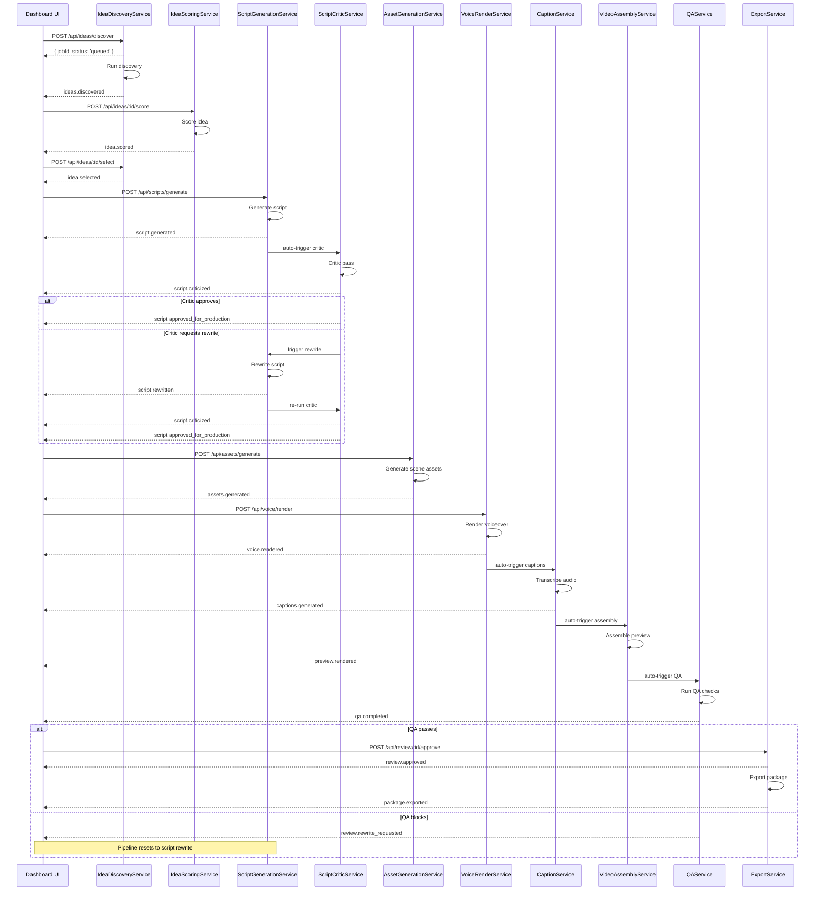

# DarkTube OS — Event Model
Version: 1.0

---

## Event Architecture

V1 uses synchronous event emission via Node.js `EventEmitter` within the job system. Events are persisted to the `job_runs` table in SQLite immediately after emission. The UI polls job state via `GET /api/jobs/:id`. There is no external message broker in V1.

Upgrade path: In V2, replace the in-process `EventEmitter` with Redis pub/sub (or a lightweight queue such as BullMQ). The event payload shape and persistence contract remain identical — only the transport layer changes.

Key design rules:
- Every event has a stable `eventType` string in `domain.verb` format
- Every event carries the `entityType` and `entityId` of the primary affected entity
- Events are immutable once emitted
- All events are persisted — no fire-and-forget
- Consumers are co-located with producers in V1 (same process); in V2 they become separate subscribers

---

## Base Event Interface

```typescript
interface BaseEvent {
  id: string                          // CUID — unique event ID
  eventType: string                   // e.g. "channel.created"
  timestamp: string                   // ISO 8601
  entityType: string                  // e.g. "channel", "content_idea"
  entityId: string                    // CUID of the primary entity
  jobId?: string                      // CUID of the JobRun that produced this event
  payload: Record<string, unknown>    // Event-specific data
  error?: {
    code: string
    message: string
    details?: unknown
  }
}
```

---

## Event Registry

### channel.created
**Producer:** `ChannelConfigService`
**Consumers:** Dashboard (invalidate channel list cache)
**Payload:**
```typescript
interface ChannelCreatedEvent extends BaseEvent {
  eventType: 'channel.created'
  entityType: 'channel'
  payload: {
    channelId: string
    name: string
    slug: string
    niche: string
  }
  error?: null
}
```
**Persisted:** Yes

---

### channel.updated
**Producer:** `ChannelConfigService`
**Consumers:** Dashboard (invalidate channel detail cache), IdeaService (reload tone profile on next scoring run)
**Payload:**
```typescript
interface ChannelUpdatedEvent extends BaseEvent {
  eventType: 'channel.updated'
  entityType: 'channel'
  payload: {
    channelId: string
    changedFields: string[]           // e.g. ["tone_profile_json", "default_voice_id"]
    previousSlug?: string             // present if slug changed
  }
  error?: null
}
```
**Persisted:** Yes

---

### ideas.discovered
**Producer:** `IdeaDiscoveryService`
**Consumers:** IdeaService (persist ideas, transition to DISCOVERED), Dashboard (notify new ideas available)
**Payload:**
```typescript
interface IdeasDiscoveredEvent extends BaseEvent {
  eventType: 'ideas.discovered'
  entityType: 'channel'
  payload: {
    channelId: string
    pillarId?: string
    discoveredCount: number
    ideaIds: string[]                 // CUIDs of created ContentIdea rows
    seedPhrases: string[]
    source: string                    // e.g. "youtube_trending", "keyword_expansion"
  }
  error?: null
}
```
**Persisted:** Yes

---

### idea.scored
**Producer:** `IdeaScoringService`
**Consumers:** IdeaService (update ContentIdea.status to SCORED, persist score_breakdown_json), Dashboard (refresh idea list)
**Payload:**
```typescript
interface IdeaScoredEvent extends BaseEvent {
  eventType: 'idea.scored'
  entityType: 'content_idea'
  payload: {
    ideaId: string
    channelId: string
    totalScore: number
    scoreBreakdown: {
      trend_score: number
      originality_score: number
      hook_strength: number
      search_volume: number
      competition_gap: number
      audience_fit: number
      production_feasibility: number
    }
    scorerModel: string
  }
  error?: null
}
```
**Persisted:** Yes

---

### idea.selected
**Producer:** `IdeaService` (on manual selection via API or auto-selection threshold)
**Consumers:** ScriptService (queue for script generation if auto-pipeline enabled), Dashboard (update idea status)
**Payload:**
```typescript
interface IdeaSelectedEvent extends BaseEvent {
  eventType: 'idea.selected'
  entityType: 'content_idea'
  payload: {
    ideaId: string
    channelId: string
    pillarId?: string
    title: string
    totalScore: number
    selectedBy: string               // user identifier or "auto"
  }
  error?: null
}
```
**Persisted:** Yes

---

### script.generated
**Producer:** `ScriptGenerationService`
**Consumers:** ScriptService (persist ScriptPackage, transition ContentIdea to SCRIPTING->SCRIPT_READY pending approval), Dashboard (notify script ready for review)
**Payload:**
```typescript
interface ScriptGeneratedEvent extends BaseEvent {
  eventType: 'script.generated'
  entityType: 'script_package'
  payload: {
    scriptPackageId: string
    ideaId: string
    channelId: string
    wordCount: number
    estimatedDurationSeconds: number
    hookVariantsCount: number
    beatCount: number
    generationModel: string
    generationPromptVersion: string
  }
  error?: null
}
```
**Persisted:** Yes

---

### script.criticized
**Producer:** `ScriptCriticService`
**Consumers:** ScriptService (persist critic_notes_json, transition status to CRITIC_REVIEW or BLOCKED), Dashboard (notify review outcome)
**Payload:**
```typescript
interface ScriptCriticizedEvent extends BaseEvent {
  eventType: 'script.criticized'
  entityType: 'script_package'
  payload: {
    scriptPackageId: string
    ideaId: string
    verdict: 'APPROVE' | 'REWRITE' | 'BLOCK'
    overallScore: number
    issueCount: number
    criticModel: string
    autoRewrite: boolean             // true if auto-rewrite triggered
  }
  error?: null
}
```
**Persisted:** Yes

---

### script.rewritten
**Producer:** `ScriptRewriteService`
**Consumers:** ScriptService (update ScriptPackage fields, increment rewrite_count, return to CRITIC_REVIEW), Dashboard (notify rewrite complete)
**Payload:**
```typescript
interface ScriptRewrittenEvent extends BaseEvent {
  eventType: 'script.rewritten'
  entityType: 'script_package'
  payload: {
    scriptPackageId: string
    ideaId: string
    rewriteCount: number
    rewriteInstructions: string
    wordCount: number
    estimatedDurationSeconds: number
    rewriteModel: string
  }
  error?: null
}
```
**Persisted:** Yes

---

### script.approved_for_production
**Producer:** `ScriptService` (manual approval via API or auto-approval when critic passes)
**Consumers:** VideoProjectService (transition VideoProject to PENDING_ASSETS), IdeaService (transition ContentIdea to SCRIPT_READY), Dashboard (unlock production pipeline UI)
**Payload:**
```typescript
interface ScriptApprovedForProductionEvent extends BaseEvent {
  eventType: 'script.approved_for_production'
  entityType: 'script_package'
  payload: {
    scriptPackageId: string
    ideaId: string
    channelId: string
    videoProjectId: string
    approvedBy: string               // user identifier or "auto"
    selectedHook: string
  }
  error?: null
}
```
**Persisted:** Yes

---

### assets.generated
**Producer:** `AssetGenerationService`
**Consumers:** VideoProjectService (update AssetPlan status, check pipeline readiness), Dashboard (show asset thumbnails)
**Payload:**
```typescript
interface AssetsGeneratedEvent extends BaseEvent {
  eventType: 'assets.generated'
  entityType: 'asset_plan'
  payload: {
    assetPlanId: string
    scriptPackageId: string
    videoProjectId: string
    totalScenes: number
    successfulScenes: number
    failedScenes: number
    provider: string
  }
  error?: null
}
```
**Persisted:** Yes

---

### voice.rendered
**Producer:** `VoiceRenderService`
**Consumers:** VideoProjectService (transition VideoProject to VOICE_READY, check if CaptionTrack can start), CaptionService (auto-trigger caption generation if enabled)
**Payload:**
```typescript
interface VoiceRenderedEvent extends BaseEvent {
  eventType: 'voice.rendered'
  entityType: 'voice_render'
  payload: {
    voiceRenderId: string
    scriptPackageId: string
    videoProjectId: string
    audioFilePath: string
    durationSeconds: number
    fileSizeBytes: number
    provider: string
    voiceId: string
    costCredits: number
  }
  error?: null
}
```
**Persisted:** Yes

---

### captions.generated
**Producer:** `CaptionService`
**Consumers:** VideoProjectService (transition VideoProject to CAPTIONS_READY, check if preview assembly can start)
**Payload:**
```typescript
interface CaptionsGeneratedEvent extends BaseEvent {
  eventType: 'captions.generated'
  entityType: 'caption_track'
  payload: {
    captionTrackId: string
    scriptPackageId: string
    videoProjectId: string
    voiceRenderId: string
    srtPath: string
    vttPath: string
    wordCount: number
    provider: string
  }
  error?: null
}
```
**Persisted:** Yes

---

### preview.rendered
**Producer:** `VideoAssemblyService`
**Consumers:** VideoProjectService (transition VideoProject to PREVIEW_RENDERED), QAService (auto-trigger QA run if enabled), Dashboard (enable preview playback)
**Payload:**
```typescript
interface PreviewRenderedEvent extends BaseEvent {
  eventType: 'preview.rendered'
  entityType: 'video_project'
  payload: {
    videoProjectId: string
    channelId: string
    previewFilePath: string
    durationSeconds: number
    fileSizeBytes: number
    resolution: string
    frameRate: number
  }
  error?: null
}
```
**Persisted:** Yes

---

### qa.completed
**Producer:** `QAService`
**Consumers:** VideoProjectService (transition VideoProject to REVIEW_READY or back to PENDING_ASSETS on BLOCK), Dashboard (show QA results panel)
**Payload:**
```typescript
interface QaCompletedEvent extends BaseEvent {
  eventType: 'qa.completed'
  entityType: 'qa_run'
  payload: {
    qaRunId: string
    videoProjectId: string
    decision: 'PASS' | 'REVIEW' | 'BLOCK'
    overallScore: number
    audioScore: number
    captionSyncScore: number
    visualScore: number
    durationScore: number
    warningCount: number
    blockCount: number
  }
  error?: null
}
```
**Persisted:** Yes

---

### review.approved
**Producer:** `ReviewService` (human action via API)
**Consumers:** VideoProjectService (transition VideoProject to APPROVED), ExportService (auto-trigger export if enabled), Dashboard (unlock export controls)
**Payload:**
```typescript
interface ReviewApprovedEvent extends BaseEvent {
  eventType: 'review.approved'
  entityType: 'video_project'
  payload: {
    videoProjectId: string
    channelId: string
    approvedBy: string
    notes?: string
    qaRunId: string
  }
  error?: null
}
```
**Persisted:** Yes

---

### review.rewrite_requested
**Producer:** `ReviewService` (human action via API or QA BLOCK auto-trigger)
**Consumers:** ScriptService (revert ScriptPackage to REWRITE state), VideoProjectService (revert VideoProject to PENDING_ASSETS), Dashboard (show rewrite request notification)
**Payload:**
```typescript
interface ReviewRewriteRequestedEvent extends BaseEvent {
  eventType: 'review.rewrite_requested'
  entityType: 'video_project'
  payload: {
    videoProjectId: string
    scriptPackageId: string
    requestedBy: string              // user identifier or "qa_auto"
    instructions: string
    qaRunId?: string
  }
  error?: null
}
```
**Persisted:** Yes

---

### package.exported
**Producer:** `ExportService`
**Consumers:** PublishPackageService (finalize PublishPackage, set status to READY), VideoProjectService (transition VideoProject to EXPORTED), Dashboard (show export folder link)
**Payload:**
```typescript
interface PackageExportedEvent extends BaseEvent {
  eventType: 'package.exported'
  entityType: 'publish_package'
  payload: {
    publishPackageId: string
    videoProjectId: string
    channelId: string
    exportFolderPath: string
    videoFilePath: string
    thumbnailFilePath: string
    metadataJsonPath: string
    captionsPath: string
  }
  error?: null
}
```
**Persisted:** Yes

---

### analytics.synced
**Producer:** `AnalyticsService`
**Consumers:** LearningService (trigger learning update if sufficient new data), Dashboard (refresh analytics panels)
**Payload:**
```typescript
interface AnalyticsSyncedEvent extends BaseEvent {
  eventType: 'analytics.synced'
  entityType: 'analytics_snapshot'
  payload: {
    snapshotId: string
    videoProjectId: string
    channelId: string
    snapshotDate: string
    views: number
    likes: number
    averageViewPercentage: number
    ctr: number
  }
  error?: null
}
```
**Persisted:** Yes

---

### learning.updated
**Producer:** `LearningService`
**Consumers:** IdeaScoringService (reload scoring weights on next run), ScriptGenerationService (reload tone preferences on next run), Dashboard (show learning update notification)
**Payload:**
```typescript
interface LearningUpdatedEvent extends BaseEvent {
  eventType: 'learning.updated'
  entityType: 'channel'
  payload: {
    channelId: string
    updatedAt: string
    snapshotCount: number            // number of snapshots used for this update
    metricsConsidered: string[]      // e.g. ["averageViewPercentage", "ctr"]
    modelVersion: string
  }
  error?: null
}
```
**Persisted:** Yes

---

### job.failed
**Producer:** Any job service (emitted on unhandled job failure)
**Consumers:** Dashboard (show error notification), JobService (write FAILED status and error to JobRun row)

Note: This event is not in spec section 20.1 but is required for operational visibility. Any service that catches an unhandled exception during a job must emit this event before returning.

**Payload:**
```typescript
interface JobFailedEvent extends BaseEvent {
  eventType: 'job.failed'
  entityType: string                 // entity type the job was processing
  payload: {
    jobId: string
    jobType: string                  // e.g. "script.generate"
    entityId: string
    errorCode: string
    errorMessage: string
    errorDetails?: unknown
    attemptNumber: number
    durationMs: number
  }
  error: {
    code: string
    message: string
    details?: unknown
  }
}
```
**Persisted:** Yes

---

## Pipeline Event Flow

The following sequence shows the full pipeline from idea discovery to package export, with events fired at each step.


